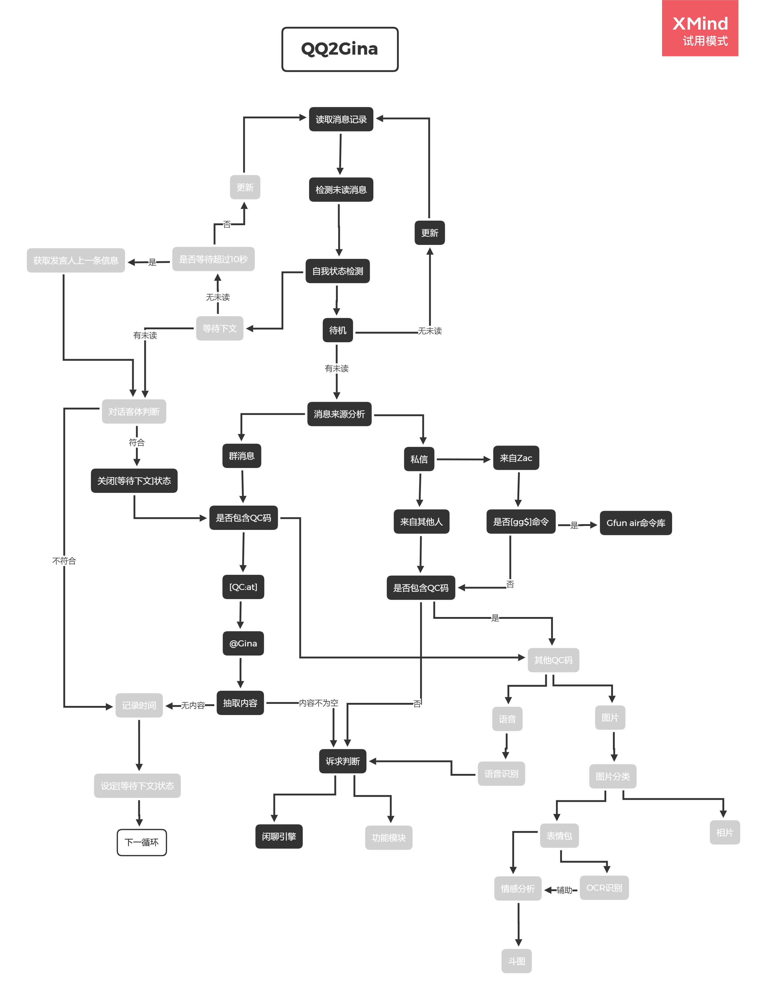

# Q2G 说明文档

## [ 基本情况 ]

### 依赖库

| 库名字     | 备注                         |
| ---------- | ---------------------------- |
| os         | 系统操作                     |
| re         | 正则表达式                   |
| ~~csv~~    | excel数据读写                |
| ~~pygame~~ | 多媒体相关                   |
| requests   | 联网，支持QQ上的所有操作     |
| json       | 包装http请求                 |
| gfun_air   | 功能集(自建库)               |
| spider     | 一些用到网页的功能（自建库） |

### 依赖文件

| 文件名       | 备注                           |
| ------------ | ------------------------------ |
| logs/XXX.log | 聊天记录日志文件(由cqhttp提供) |
| readed.temp  | 记录最新信息是否已读，临时文件 |

### 基本文件结构

| 文件名         | 注释                                                         |
| -------------- | ------------------------------------------------------------ |
| go-cqhttp.exe  | 【平台】将QQ与http-api连接起来的工具，负责**通讯**。基于Go语言开发。 |
| qq2gina.py     | 【核心】担任所有逻辑处理的python脚本，即**大脑**。           |
| gfun_air.py    | 【主体】负责所有功能的具体实现。                             |
| gtime.py       | 【模块】所有时间相关功能                                     |
| ghuman.py      | 【模块】处理所有与人物相关的问题                             |
| spider.py      | 【模块】所有与网页相关的功能                                 |
| chatme.py      | 【模块】图灵机器人闲聊接口                                   |
| readed.temp    | 【文档】运行状态临时文件                                     |
| People.xml     | 【文档】人物信息库                                           |
| Dictionary.txt | 【文档】（聊天）本地语料库                                   |




### 

## 已完成项

#### 网络爬虫

- [x] 随机靓图（~~目前基于静态网址，之后要优化为实时随机获取~~）

- [x] 毒鸡汤

#### API

- [x] 闲聊（图灵机器人）

#### 本地

- [ ] 初步搭建人物库

## 功能介绍

### 一. 关于后端

> 命令行窗口界面

#### 单轮对话的显示项目规范

1. **对话来源判断**

   群消息 or 私聊；消息发送者

2. **信息性质分类**

   普通对话 or CQ码 or 混合消息

   <sup>（当包含CQ码时，显示CQ码具体分类。)</sup>

3. **诉求判断器的判断结果，并附上简单的判断摘要。**
4. **打印姬娜的回答**
5. **发送消息的状态反馈**

示例：

```
==========群消息(201226-174228)==========
$ 超哥：[普通文本]
#明天的天气怎么样#
----------------------------------------
【诉求判断器】询问天气...
Require: ['weather', 1, ['明天']]
----------------------------------------
$ 姬娜：明天是12月27日，周日，晴，最高温度13°，最低温度3°。
{"data":{"message_id":-1147435726},"retcode":0,"status":"ok"}
========================================
```


### 二. 功能解析

#### 1. gfun_air

> 功能库

| 依赖库                            | 备注                   |
| --------------------------------- | ---------------------- |
| os                                |                        |
| ~~pygame~~                        | 目前没用到(发不了语音) |
| ~~mutagen.mp3 $\rightarrow$ MP3~~ | 处理音频(没用到)       |
| time                              | 设置延迟               |
| jieba.posseg                      | 分词、词性标注         |
| chatme                            | [自建库]闲聊引擎       |

* **主体**
  * **Require类**：诉求判断器
  * **do()函数**：命令 - 逻辑处理
  * **gfun()函数**：除了`gg$`命令外所有的逻辑处理

1. **Require(sentence)**

   > sentence := 文本内容。Require()将基于此文本内容做出诉求判断。

   | 元素           | 说明                                                         |
   | -------------- | ------------------------------------------------------------ |
   | self.s         | 即`sentence`，判断对象。                                     |
   | self.whois()   | 【诉求】询问人物。【返回结果】`[#0/1:是否此述求#,#str:询问对象#]` |
   | self.weather() | 【诉求】询问天气。【返回结果】`[#0/1:是否此述求#,#0/1:是否询问某天天气#,#str:询问的时间#]` |
   | self.run()     | 【主函数】判断诉求。【返回结果】`[#str:诉求名#,#附加信息#*]` |

2. **gfun(ask) **

   > ask := 输入文本（诉求）

   诉求条件语句块：

   (1) showpic : 要求发给用户一些优美的图片

   附加信息

   (2) whois : 询问某个人的身份

   (3) weather : 询问天气

   (4) other ： 闲聊

   

#### 2. Chatme

> 闲聊引擎

| 依赖库         | 备注                |
| -------------- | ------------------- |
| os             | 本地资料相关操作    |
| requests       | 上网，与api接口通讯 |
| random         | 摇号，避免单调      |
| json           | 包装http请求        |
| urllib.request |                     |

| 依赖文件       | 备注           |
| -------------- | -------------- |
| Dictionary.txt | 本地语料库字典 |
